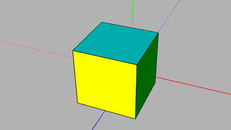

# User Manual

## Table of contents
- [Quick start guide](#quick-start-guide)
- [Concepts](concepts.md)
- [Tools](tools.md)
- [Editor](editor.md)
- [Browser](browser.md)
- [Steps](steps.md)
- [Settings](settings.md)

## Quick start guide

Draw a [sketch](sketch.md) by clicking on the [rectangle draw](sketch.md#rectangle) tool in the tools menu and then [clicking and dragging](tools.md#operation) on the viewport. Finally [close the sketch](editor.md#scene) to turn the drawn lines into a 3D face.

Use the middle click to [orbit](tools.md#orbit) around that face and inspect it. Position the camera so it points at the face slightly sideways.

Now turn that face into a cube by [extruding](push-pull.md) it - select the [Push/Pull tool](push-pull.md#pushpull), click on the face, move the mouse until the face starts extruding, then [type `1mm`](editor.md#value-types) and [press the `enter` key](editor.md#info-bar).

The resulting object is not quite square, so let's go back and edit its sketch by [double clicking on the Sketch step](browser.md#steps) inside the browser menu. Now select one of the horizontal and one of the vertical lines, using the [select tool](tools.md#select), by clicking on the first one, then holding the `ctrl` key and clicking on the second one. Click on the [equal constraint](sketch.md#equal) to make both of the lines the same length. Now select the vertical of the two lines, press the `k` key, followed by the `i` key to set a [height constraint](sketch.md#height) and enter `1mm` when [prompted](editor.md#property-dialog) for a value. Close the sketch again to see the object is finally a perfect cube.

Press the [`b` key](editor.md#keyboard-shortcuts) to select the [color bucket tool](tools.md#bucket) and paint some of the faces with different colors.

Create another [instance of the cube's body](concepts.md) by double clicking on the ["Bodies" tab](browser.md#bodies) in the browser menu - this will initiate the placing of another cube inside the viewport - press the left arrow key to [constrain the movement to the Z axis](editor.md#axis-alignment) and click to finally place the new cube in line with the old one.

The whole scene can now be saved for later via the system menu.
