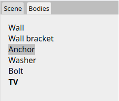

# [User Manual](README.md) > Browser

Next: [Steps](steps.md),
Previous: [Editor](editor.md)

## Table of contents
- [Bodies](#bodies)
- [Scene](#scene)
- [Steps](#steps)
- [Details](#details)

## Bodies

Lists all of the bodies in the scene, emphasizing the body of the [entered instance](editor.md#scene) if any.

Clicking on an entry from the list highlights it and opens a [details browser](#details) for that body.

Double-clicking on it instead, creates a new instance to the scene and lets the user place it on the viewport. If currently editing another body, a [SubInstance](subinstance.md) step inside the edited body is created instead.

## Scene

Lists the instance hierarchy of scene, emphasizing the [entered instance](editor.md#scene) if any.

All selected instances are shown highlighted in the scene browser, and conversely, clicking on an entry from the list selects its corresponding instance in the viewport and opens a [details browser](#details) for it.

Double-clicking on an entry instead, enters its corresponding instance so that its body can be edited.

## Steps

Lists all steps inside the edited body, emphasizing the [entered step](editor.md#scene) if any. All steps but the [tip](concepts.md#steps) are grayed-out, signifying their resulting geometry is not what is shown in the viewport.

Clicking on an entry from the list highlights it and opens a [details browser](#details) for that step.

Double-clicking on an entry instead, enters its corresponding step for editing.

## Details

Exposes various information about the selected entity, its properties and components.

Non-grayed-out property values can be edited by clicking on them and then manually inputting a new value with the appropriate [type](editor.md#value-types) and [units](editor.md#units).

