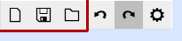

# [User Manual](README.md) > Concepts

Next: [Tools](tools.md),
Previous: [Quick start guide](README.md#quick-start-guide)

## Table of contents
- [Scene](#scene)
- [Bodies](#bodies)
- [Instances](#instances)
- [Steps](#steps)
- [Parametric design](#parametric-design)

## Scene
The scene is a collection of bodies and their instances, and represents the whole of the project.

Scenes can be created, saved and loaded via the respective icons in the system menu:

## Bodies
A body defines a unique *object type* - a "blueprint" for building objects. Each body is made out of consecutive steps that describe how it is constructed.

## Instances
An instance is a concrete object constructed from a body. While bodies are unique, there can be multiple instances of the same body.

When a body is edited, all of the instances of that body will automatically update to reflect the new changes.

Additionally, each instance can have its own scene placement and size.

## Steps
A step is an action to be performed on a body in order to modify the body's geometry.

In contrast to directly modifying the geometry as in traditional 3D modelling, using steps allows making changes to intermediary steps or altogether reverting them, temporarily or permanently, without having to remodel large parts of the object or resort to unorthodox and clunky object versioning.

One of the steps inside a body is active and designated as the "tip" of the body, and its resulting geometry is used as the body's geometry. This is usually the last step, unless another has manually been assigned as the tip.

## Parametric design
A key feature of all CAD software is having the ability to parametrically specify all body, instance and step property values. These parameters can be a mix of values, formulas and references to other property values.

Using parametric design eliminates the need to calculate the positions of geometric features by hand in many traditional 3D modelling software, which could become practically impossible depending on the number of features needed to be calculated.

Moreover, properly utilizing parametric values and referencing other properties where necessary makes updating a design a very easy process, that automatically propagates the necessary changes, or at least - with minimal intervention, instead of having to rebuild most of the geometry from scratch.
