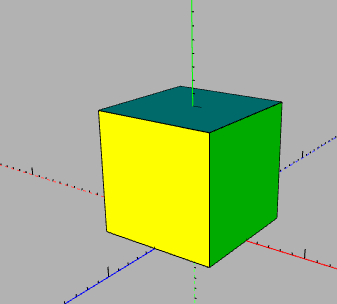
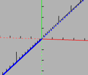
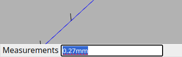
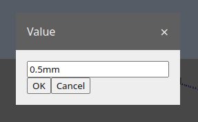

# [User Manual](README.md) > Editor

Next: [Browser](browser.md),
Previous: [Tools](tools.md)

## Table of contents
- [Viewport](#viewport)
  - [Navigation](#navigation)
  - [Scene](#scene)
  - [Hovered plane](#hovered-plane)
  - [Axis alignment](#axis-alignment)
- [Keyboard shortcuts](#keyboard-shortcuts)
- [Info bar](#info-bar)
- [Property dialogs](#property-dialog)
- [Value types](#value-types)
- [Units](#units)
  - [Distance](#distance)
  - [Angle](#angle)

## Viewport

The viewport is the central area of the application and is where the user can visually interact with the scene. It contains all of the scene's objects, placed relative to each other according to their position, rotation and scale, and is viewed through a "virtual camera" that can be controlled by the user.

### Navigation
The viewport's camera, and thus what the user sees, can be moved around the scene by [moving up/down/left/right and orbiting](tools.md#orbit) and [moving forward/back and zooming](tools.md#zoom).

### Scene
The scene hierarchy can also be navigated through the viewport, while using the [select tool](tools.md#select), by double-clicking on an object, which enters its corresponding instance, allowing for editing of that instance's body. In some cases where the double-clicked geometry directly belongs to a [step](steps.md), that step could be entered for editing instead. Pressing the `esc` key while no action is being performed exits the entered step.

Geometry not part of the entered instance (if any) will be shown grayed-out.

Certain objects can be marked not "visible", which will exclude them and their descendents from being shown in the viewport. An object and its descendents will be shown nevertheless if it is currently being edited.

### Hovered plane
Most actions performed in the viewport take place in 3D space, which makes it impossible to always correctly translate the 2D position of the mouse on the screen to the intended 3D coordinates inside the scene.

So to make interactions with the viewport as intuitive as possible, the concept of a "hovered plane" is used, in which the mouse position is translated to the corresponding 3D position the cursor points at on a virtual plane placed inside the scene.

To determine what that plane is, the following method is used:
- if the mouse is over an object's surface, then that would be used as the hovered plane
- if the mouse is over empty space, depending on which plane the camera is looking at the straightest (closest to perpendicular):
  - if inside a body, the X, Y or Z plane relative to the body
  - otherwise, the global X, Y or Z plane

### Axis alignment

In addition to [hovered planes](#hovered-plane), some actions can be constrained along a specific axis using the [arrow keys](#axis).

When an axis is locked for alignment it becomes highlighted.

## Keyboard shortcuts
In addition to the user interface, most actions can also be performed using keyboard shortcuts for increased ergonomics and productivity.

Shortcuts can be in one of the following formats:

Type             | Example                | Explanation
-----------------|------------------------|------------
single key       | `esc`                  | Press and release the "Esc" (escape) key
key combination  | `ctrl` + `shift` + `z` | Press in order and hold the "Ctrl" (control), "Shift" and "Z" keys, then release them
key sequence     | `v`, `p`               | Press in order the "V", then the "P" key, releasing after each keypress
mix of the above | `c`, `alt` + `z`       | Press and release the "C" key, then press in order and hold the "Alt" and "Z" keys, then release them

Most of the keyboard shortcuts throughout the application can be changed in the [settings dialog](settings.md#keyboard-shortcuts).

### General
shortcut               | Description
-----------------------|------------
`delete`               | Deletes the selected objects
`ctrl` + `c`           | Copies the selected objects
`ctrl` + `v`           | Pastes the selected objects
`ctrl` + `z`           | Undoes the changes caused by the last action
`ctrl` + `shift` + `z` | Redoes the changes undone by the last Undo
`esc`                  | Cancels the currently performed action

### Camera
shortcut | Description
---------|------------
`1`      | Look along the X-axis
`2`      | Look along the Y-axis
`3`      | Look along the Z-axis
`4`      | Look back along the X-axis
`5`      | Look back along the Y-axis
`6`      | Look back along the Z-axis
`0`      | Look along the XYZ-axis
`v`, `p` | Toggle between perspective and orthographic projection

### Axis
shortcut      | Description
--------------|------------
`right arrow` | Align to X-axis
`up arrow`    | Align to Y-axis
`left arrow`  | Align to Z-axis

## Info bar

Situated at the bottom of the viewport, the info bar provides extra information about the current action, tool, hovered object, etc. During some actions, their values can be edited or typed in manually, using the appropriate [type](#value-types) and [units](#units), providing extra precision and ergonomics over mouse movement.

## Property dialog

Some actions requiring a value are not always triggered by a user interaction or an interaction that can represent such a value. In these cases a property dialog is presented, prompting for user input to be entered manually using the appropriate [type](#value-types) and [units](#units).

## Value types
All property values have a type, and are identified by and represented as a case-insensitive formatted text string, which includes one or more values (with or without units), and optionally a prefix, infix and a suffix.

Type            | Units    | Example      | Description
----------------|----------|--------------|------------
`text`          |          | `Foo`        | Text string used in values like names or descriptions
`number`        |          | `42`         | A simple number used in values like quantities or IDs
`angle`         | Angle    | `2rad`       | Represents angles between lines
`distance`      | Distance | `2.5cm`      | Represents lengths or distances
`2D vector`     |          | `[10, 20]`   | Used in values like 2D normals or scale
`3D vector`     |          | `[0, 1, 0]`  | Used in values like 3D normals or scale
`2D coordinate` | Distance | `[1m, 2cm]`  | Represents dimensions, positions or offsets in 2D space
`3D coordinate` | Distance | `[0, 0, 2m]` | Represents dimensions, positions or offsets in 3D space
`color`         |          | `#FF0000`    | A color in hexadecimal notation.
`boolean`       |          | `true`       | Represents an on or off state, where `true`, `t`, `on`, `1`, `yes` or `y` means "enabled", and `false`, `f`, `off`, `0`, `no` or `n` means "disabled"

## Units
Units are represented as a case-insensitive suffix after the value and determine the value's magnitude and purpose. The suffix may be omitted, which will be assumed to mean the value is in its base unit, highlighted in the tables below.

### Distance
Suffix    | In base units   | Example      | Description
----------|-----------------|--------------|------------
`pm`      | `0.000000001mm` | `pm`         | Picometers
`nm`      | `0.000001mm`    | `nm`         | Nanometers
`um`      | `0.001mm`       | `um`         | Micrometers
**`mm`**  | **`1mm`**       | **`25.4mm`** | **Millimeters**
`cm`      | `10mm`          | `cm`         | Centimeters
`m`       | `1000mm`        | `m`          | Meters
`km`      | `10000000mm`    | `km`         | Kilometers

### Angle
Suffix    | In base units | Example      | Description
----------|---------------|--------------|------------
**`rad`** | **`1rad`**    | **`0.5rad`** | **Radians**
`deg`     | `0.017453rad` | `45deg`      | Degrees
`°`       | `0.017453rad` | `135°`       | Degrees, same as above
