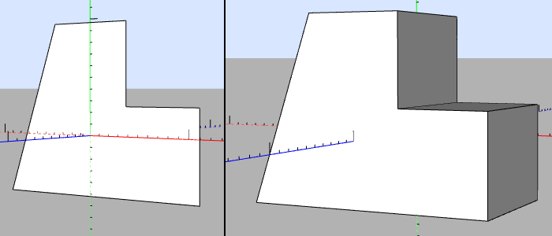

# [User Manual](README.md) > [Steps](steps.md) > PushPull

Next: [Steps > SubInstance](subinstance.md),
Previous: [Steps > Sketch](sketch.md)

## Table of contents
- [Description](#description)
  - [Parameters](#parameters)
- [Tools](#tools)
  - [Push/Pull](#pushpull)

## Description

Makes extrusions or holes in the body using a face as profile.

### Parameters

#### Attachment
Name     | Type                              | Description
---------|-----------------------------------|------------
FaceId   | [number](editor.md#value-types)   | Which face should be pushed or pulled
Distance | [distance](editor.md#value-types) | How far should the face be pushed or pulled
Reverse  | [boolean](editor.md#value-types)  | Whether to flip the direction of the action

## Tools
The PushPull step makes the following additional tools available globally if no other step is currently being edited, in which case when used, a new PushPull step is created inside the currently entered instance's body.

### Push/Pull

Default keyboard shortcut: `p`

Pushes or pulls the [selected or underlying](tools.md#operation) face to extrude it or create a hole with the same profile as the face.
