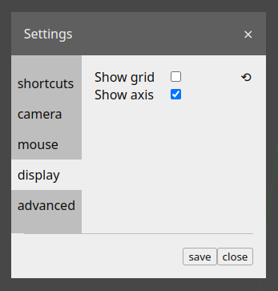
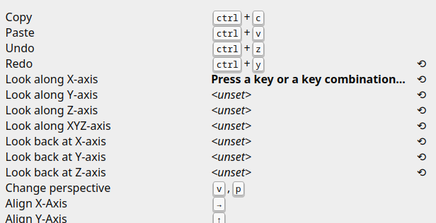
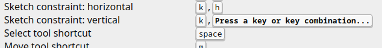

# [User Manual](README.md) > Settings

Previous: [Steps > SubInstance](subinstance.md)

## Table of contents
- [Description](#description)
- [Keyboard shortcuts](#keyboard-shortcuts)

## Description

Application settings can be configured by clicking on the "cog" icon in the system menu. Related configuration options are grouped in categories.

After modifying the settings and clicking on the "save" button, the configuration is persisted in the browser.

Options that have been previously modified and their values differ from the defaults, will be marked as such by a button next to them, that allows reverting the option to its default value.

## Keyboard shortcuts

This settings category allows configuring a [keyboard shortcut](editor.md#keyboard-shortcuts) for triggering each action.

To change the shortcut for a specific action, click on its value and then press the new desired keyboard shortcut.

Single key and key combination shortcuts can be pressed the same as when invoking them.

Key sequence shortcuts on the other hand need to be set differently - firstly enter the first part of the sequence as normal, then edit the shortcut again and press the `tab` key, and then finally enter the second part of the sequence.

When setting another action's shortcut, if that shortcut matches the first part of another action's key sequence shortcut, the entered shortcut is automatically converted to a sequence and the user is prompted to enter the second part for the sequence - a shortcut cannot be the same as the first part of another shortcut's key sequence, as there's no way to distinguish between them when invoking the shortcuts.

Multiple actions cannot have the same shortcut. If the same shortcut is assigned to another action, the previous action's shortcut will be unset.

Shortcuts can also be unset by pressing the `delete` key when setting them.

Shortcuts can only contain the `ctrl`, `alt`, `shift` and arrow keys, as well any printable key (letter, number, symbol, the `space` key, etc.)
