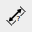
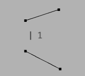
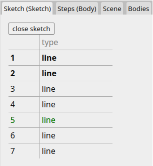
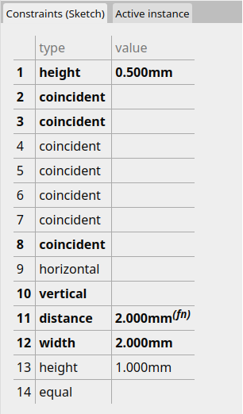

# [User Manual](README.md) > [Steps](steps.md) > Sketch

Next: [Steps > PushPull](push-pull.md),
Previous: [Steps](steps.md)

## Table of contents
- [Description](#description)
  - [Parameters](#parameters)
- [Constraints](#constraints)
  - [Distance](#distance)
  - [Width](#width)
  - [Height](#height)
  - [Equal](#equal)
  - [Coincident](#coincident)
  - [Horizontal](#horizontal)
  - [Vertical](#vertical
  - [Angle](#angle))
- [Browser]
  - [Sketch elements](#sketch-elements)
  - [Constraint details](#constraint-details)
- [Tools](#tools)
  - [Support geometry](#support-geometry)
  - [Line](#line)
  - [Rectangle](#rectangle)

## Description

The Sketch step allows drawing 2D geometry that can be later transformed to a 3D face according to the Sketch's [attachment](#attachment). The 2D geometry consists of [lines](#line) which, along with their endpoints, can be [constrained](#constraints) in terms of dimensions, position, orientation, etc.

### Parameters

#### Attachment
Specifies where in 3D space the 2D Sketch should be placed and could either be of type "plane" (one of the X, Y or Z planes of the body) or "face" (one of the body's face surfaces).

Name   | Type                                   | Description
-------|----------------------------------------|------------
Type   | `plane` or `face`                      | The type of Sketch attachment
Normal | [3D vector](editor.md#value-types)     | The orientation of the Sketch relative to the body
Offset | [3D coordinate](editor.md#value-types) | The position of the Sketch relative to the body
FaceId | [number](editor.md#value-types)        | Which face the Sketch is attached to (only if type is `face`)

## Constraints
Constraints define rules that their constrained elements (one or more lines and endpoints) must satisfy. When sketch geometry is moved around, related elements automatically update to satisfy all constraint rules.

Constraints are applied to the selected elements after selecting the corresponding constraint icon next to the tools menu. If not enough elements have been selected to apply the constraint, the application will wait until more elements have been added to the selection or the action has been cancelled.

Additionally the body's X and Y axes, as well as the origin point can be selected as constraint elements.

### Distance

Fixes the distance between two or more points and/or the length of one or more lines.

### Width

Fixes the horizontal distance between two or more points and/or the horizontal distance between the endpoints of one or more lines.

### Height

Fixes the vertical distance between two or more points and/or the vertical distance between the endpoints of one or more lines.

### Equal

Makes the length of two or more lines the same.

### Coincident

Makes the position of two or more points the same.

### Horizontal

Makes the vertical position between two or more points the same and/or the one or more lines horizontal.

### Vertical

Makes the horizontal position between two or more points the same and/or the one or more lines vertical.

### Angle

Fixes the angle between two lines.

### Parallel

Makes the selected lines parallel to each other.

## Browser
### Sketch elements

Lists the sketch elements and their type, emphasizing the selected ones if any. Clicking on an entry from the list selects its corresponding element in the viewport. Support geometry is listed in green color.

### Constraint details

Lists the sketch constraints, their type, and their value if any.

Selected constraints in the viewport are emphasized in the list. If there are no selected constraints, but there are selected elements instead, the related constraints of these selected elements are emphasized. Clicking on an entry from the list selects its corresponding constraint in the viewport.

## Tools
The Sketch step makes the following additional tools available while a sketch is being edited.

The move and rectangle tools are also available globally if no other step is currently being edited, in which case when used, a new Sketch step is created inside the currently entered instance's body.

### Support geometry

Shortcut: `d`, `s`

Toggles the selected elements between normal and support mode. If no elements are selected, toggles whether new elements should be drawn as support geometry, rendered as a dashed green line.

Support geometry has all the same properties as regular geometry but is shown only inside sketches - it is not drawn outside editing a sketch and is not used when triangulating faces.

What makes support elements extremely useful is that it can, just like regular elements, share constraints with other regular elements. This allows creating complex compound constraints (e.g a triangle with height equal to its base), without the resulting faces being needlessly split into multiple segments.

### Move
The global [move tool](tools.md#move) is enabled, allowing it to move the [selected or underlying](tools.md#operation) lines and endpoints.

### Line

Shortcut: `d`, `l`

Draws a line between the [origin and target](tools#operation) points.

When a line is finished, a follow up line is automatically initiated, with its origin point the same as the previous line's target point, and a coincident constraint is added between the two points. This goes on until the last line is ended on another point or the action is cancelled.

Starting or ending a line on another point automatically adds a coincident constraint between the two overlapping points.

X and Y [axis alignment](editor.md#axis-alignment) is taken into consideration when drawing lines, aligning them horizontally or vertically and adding the corresponding constraint to the line.

starting/ending on points

### Rectangle

Shortcut: `d`, `r`

Draws a rectangle between the [origin and target](tools#operation) points using 4 lines and the appropriate coincident, horizontal and vertical constraints.

Starting or ending a rectangle on another point automatically adds a coincident constraint between the overlapping points.
