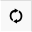
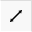
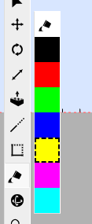
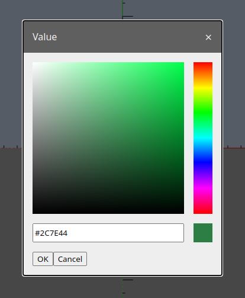

# [User Manual](README.md) > Tools

Next: [Editor](editor.md),
Previous: [Concepts](concepts.md)

## Table of contents
- [Description](#description)
  - [Operation](#operation)
- [Tools](#tools)
  - [Select](#select)
  - [Move](#move)
  - [Rotate](#rotate)
  - [Scale](#scale)
  - [Bucket](#bucket)
  - [Orbit](#orbit)
  - [Zoom](#zoom)

## Description
Tools change the action that should be performed when pressing the primary mouse button inside the viewport. Tools are considered active while the mouse button is held.

Tools can be selected by either clicking on them in the tool menu or pressing their respective [keyboard shortcut](editor.md#keyboard-shortcuts). Only one tool can be selected at a time, thus deselecting the previously selected one and cancelling and pending action it might have performed.

### Operation
All tools operating on viewport objects, unless specified otherwise, work in the following way upon activation:
- if there are [selected objects](#select), operate on those
- otherwise, if there is an object under the cursor, operate on that object

Tools that operate over a distance to modify the scene in the viewport (drawing, moving, etc.), use the point of mouse button press as the origin point of the action and the point of mouse button release as the target point of the action. If the mouse button is clicked in place instead, then that is considered as the origin point of the action, while a second click designates the target point of the action.

Tools that navigate around the viewport, do so in relation to a pivot point that is picked the following way:
- if there's a hovered point on the object under the mouse cursor, use that point
- otherwise the pivot point used is just in front of the viewport's vantage point

## Tools
The following are a collection of application-wide tools available globally, unless otherwise stated.

### Select

Shortcut: `space`

Marks the clicked objects inside the viewport as selected. Selected objects will be highlighted and their bounding box will be drawn around them.

Holding the `ctrl` key while selecting objects will toggle their selected status, adding or removing them from the selection.

Clicking and dragging can also be used to produce a "lasso" inside the viewport, selecting all objects that fall inside its bounds.

### Move

Shortcut: `m`

Repositions the underlying or selected objects around the scene.

The move tool can work in conjunction with [axis alignment](editor.md#axis-alignment) to constrain along which axis the objects should be moved.

This tool is only available when there isn't a step currently being edited.

### Rotate

Shortcut: `r`

Rotates the underlying or selected object around its origin. Only one object can be operated on at a time.

This tool is only available when there isn't a step currently being edited.

### Scale

Shortcut: `s`

Resizes the underlying or selected objects.

This tool is only available when there isn't a step currently being edited.

### Bucket

Shortcut: `b`

Paints the underlying or selected faces of the currently entered instance's body with the selected color.

A color can be selected in one of the following ways:
- by directly selecting a color from the recent colors menu

  
- by clicking on the first item in the recent colors menu to open a color selector [property dialog](editor.md#property-dialog)

  
- using the eyedropper, by holding the `ctrl` key and clicking on an object's face inside the viewport to sample its color

On selecting a color that is not currently in the recent colors menu, that color is added to the top of the recent colors menu while the last one is removed.

This tool is only available when there isn't a step currently being edited.

### Orbit

Shortcut: `o`

Orbits the viewport around pivot point.

Holding the `shift` key changes the tool's mode to pan around the viewport instead.

Additionally, orbiting and panning can be performed while most other tools are selected and without having to cancel their current actions by pressing the middle mouse button.

### Zoom

Shortcut: `z`

Zooms the viewport towards the pivot point.

Holding the `ctrl` changes the mode of the tool to zoom away from the pivot point.

Additionally the `shift` + `+` and `-` shortcuts or the mouse wheel can be used to zoom in or out, regardless of which tool is currently being selected.

Lastly, holding `shift` while using the mouse wheel, can be used to pan forwards or backwards, regardless of the currently selected tool.
